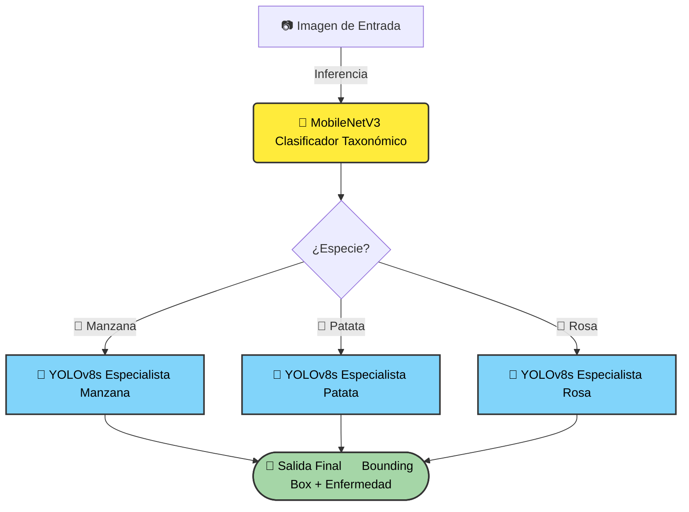

# 🍃 Detección y Clasificación de Patógenos Foliares mediante Visión por Computador

[](https://deepwiki.com/GabrielFranciscoSM/Hojas_con_resfriado)
[](https://github.com/GabrielFranciscoSM/Hojas_con_resfriado/blob/main/README.md)
[](https://grados.ugr.es/informatica/)
[](https://github.com/ultralytics/ultralytics)

> **Proyecto para la asignatura de Visión por Computador (VC)**  
> Grado en Ingeniería Informática, Universidad de Granada (UGR).

---

## 📄 Descripción del Proyecto

Este trabajo aborda el problema de la detección de enfermedades en plantas mediante un **enfoque jerárquico de dos etapas**. A diferencia de los modelos monolíticos tradicionales, nuestro sistema imita el razonamiento de un experto agrónomo: primero identifica la especie de la planta y, posteriormente, busca patologías específicas de esa especie.

El objetivo es reducir la confusión entre clases de diferentes cultivos y mejorar la precisión (**mAP**) en entornos reales.

---

## 🗂️ Datasets Utilizados

Para entrenar y validar los modelos, se recopilaron y curaron tres conjuntos de datos específicos, totalizando más de 5,000 imágenes con anotaciones detalladas.

### 1. 🍎 [Manzanas (Science Data Bank)](https://www.scidb.cn/en/detail?dataSetId=0e1f57004db842f99668d82183afd578)
Este dataset requirió un preprocesamiento para convertir máscaras de segmentación en *bounding boxes*.
*   **Total Imágenes:** 1,641
*   **Clases (5):**
    *   `Alternaria leaf spot` (278 imgs)
    *   `Brown spot` (215 imgs)
    *   `Gray spot` (395 imgs)
    *   `Rust` (344 imgs)
    *   `Healthy leaf` (409 imgs)

### 2. 🌹 [Rosas (Roboflow Universe)](https://universe.roboflow.com/rose-leaf-diseases/rose-leaf-diseases)
Dataset con alta densidad de instancias (*patches*) por imagen.
*   **Total Imágenes:** 2,725
*   **Clases (4):**
    *   `Black Spot` (5,565 instancias)
    *   `Powdery Mildew` (7,346 instancias)
    *   `Downy Mildew` (1,479 instancias)
    *   `Normal` (1,598 instancias)

### 3. 🥔 [Patatas (Roboflow)](https://app.roboflow.com/germanrv/potatoes_leaf-diseases/browse?queryText=&pageSize=50&startingIndex=0&browseQuery=true)
Dataset desafiante debido al desbalanceo de clases y similitud visual entre tizones.
*   **Total Imágenes:** 812
*   **Clases (3):**
    *   `Early Blight` (18,069 instancias)
    *   `Late Blight` (1,379 instancias)
    *   `Healthy` (364 instancias)

---

## 🏗️ Arquitectura Propuesta

Para resolver la confusión entre patologías visualmente similares de diferentes especies, implementamos un **Pipeline Jerárquico**. 

El sistema no intenta detectar todas las enfermedades a la vez (enfoque monolítico), sino que divide el problema en dos pasos lógicos:

1.  **Clasificación Taxonómica (Router):** Una red ligera (**MobileNetV3**) determina el contexto biológico (la especie).
2.  **Detección Especializada:** La imagen se enruta al modelo **YOLOv8** específico para esa especie, reduciendo el espacio de búsqueda y aumentando la precisión.


---

## 📊 Resultados Experimentales

Comparamos nuestra propuesta contra un modelo único (**Monolítico**) y un modelo con filtrado lógico (**Unificado**). La estrategia especializada obtuvo los mejores resultados globales.

| Estrategia | Manzana (mAP50) | Patatas (mAP50) | Rosas (mAP50) | **Promedio Global** |
| :--- | :---: | :---: | :---: | :---: |
| Monolítico | 0.9302 | 0.7780 | 0.9144 | 0.8742 |
| Unificado | 0.9302 | 0.7780 | 0.9142 | 0.8741 |
| **Especializado (Propuesto)** | **0.9530** | **0.8411** | **0.9569** | **0.9170** |

> **Nota:** La mejora es especialmente notable en el dataset de **Patatas** (+6.3%), demostrando que la especialización ayuda significativamente en cultivos con patologías visualmente complejas.

---

## 🚀 Instalación y Reproducción

El código está optimizado para ejecutarse en entornos como Google Colab (con GPU T4/A100).

```bash
# Clonar repositorio
git clone https://github.com/GabrielFranciscoSM/Hojas_con_resfriado.git
cd Hojas_con_resfriado

# Instalar dependencias
pip install ultralytics opencv-python-headless matplotlib
```

Para entrenar los modelos desde cero, revisa la carpeta `notebooks/` donde encontrarás los scripts de entrenamiento para la Fase 1 (MobileNet) y Fase 2 (YOLOv8).

---

## 👥 Autores

Estudiantes del Grado en Ingeniería Informática (UGR):

*   **Gabriel Sánchez Muñoz** - [gabrielfsm@correo.ugr.es](mailto:gabrielfsm@correo.ugr.es)
*   **Germán Rodríguez Vidal** - [germanrv@correo.ugr.es](mailto:germanrv@correo.ugr.es)
*   **Pablo García Bas** - [pablogarciabas@correo.ugr.es](mailto:pablogarciabas@correo.ugr.es)
*   **Miguel Ángel Moreno Castro** - [miguelangelmc@correo.ugr.es](mailto:miguelangelmc@correo.ugr.es)

---

## 📚 Referencias y Documentación

*   Para una explicación detallada de la metodología, visita nuestra [Wiki en DeepWiki](https://deepwiki.com/GabrielFranciscoSM/Hojas_con_resfriado).
*   Paper base: *Detección y Clasificación de Patógenos Foliares mediante Visión por Computador* (incluido en este repo).
